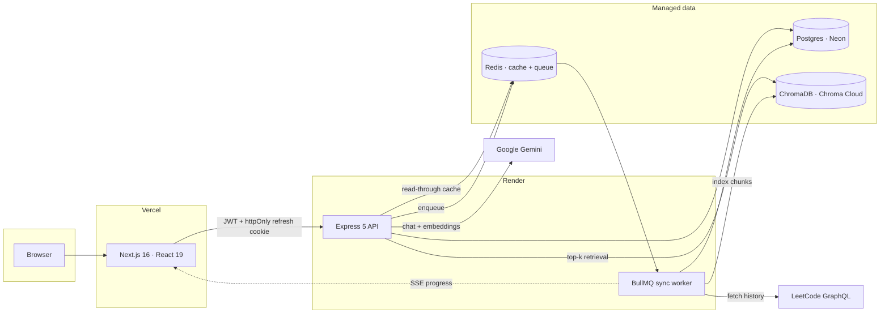

<div align="center">

# LeetSense

**LeetCode analytics with an AI mentor that actually knows your practice history.**

Sync your real LeetCode data, see where you're weak, and ask an assistant that
answers from *your* numbers instead of guessing.

[**Live demo →**](https://leetsense.vercel.app)

[](https://github.com/Abhikansh3/LeetSense/actions/workflows/ci.yml)


</div>

> [!NOTE]
> The demo runs on free infrastructure that sleeps after 15 minutes of
> inactivity. The first request can take **up to a minute** to wake it — after
> that it's fast.

---

## What it does

- **Syncs your LeetCode history** — profile aggregates, per-problem solves,
  skill-tag breakdowns and submission history, with live progress streamed over
  Server-Sent Events across nine stages.
- **Shows where you actually stand** — difficulty split, topic strength radar, a
  year-long activity heatmap, growth over time, and a paginated solve feed.
- **Answers questions about your practice** — a RAG assistant grounded in your
  synced data, so "what should I work on?" gets an answer based on your real
  weak tags rather than generic advice.
- **Keeps one person's data one person's** — every query is scoped to the
  authenticated user, including in the shared vector collection.

## Architecture



## Tech stack

| Layer | Tech |
| --- | --- |
| Monorepo | Turborepo + pnpm workspaces |
| Backend | Express 5, TypeScript (NodeNext), Zod, Pino |
| Frontend | Next.js 16, React 19, Tailwind CSS 4 |
| Data | PostgreSQL + Prisma, Redis |
| Jobs | BullMQ |
| AI / RAG | Google Gemini (chat + embeddings), ChromaDB |
| Testing | Vitest + Supertest, 195 tests |
| CI/CD | GitHub Actions, Docker, Render + Vercel |

---

## The bit worth reading: two data sources, one truth

LeetCode exposes your practice through two very different endpoints, and
conflating them has caused every user-visible bug this project has had.

| Source | What it is | Use it for |
| --- | --- | --- |
| `ProfileSnapshot` | Whole-history aggregates from the **public** profile query — total solved, difficulty split, acceptance rate, streak, skill tags. Accurate for any username, no cookie needed. | **Every total and count.** |
| `Submission` | Only what the submission endpoint returned. Without a session cookie that's ~20 recent solves. | Recent activity only. Never totals. |

Two bugs came from mixing them up: the dashboard donut counted `Submission`
rows and disagreed with the total shown beside it, and the AI mentor told a user
who had solved 81 problems that they had solved 20, because the chunker
labelled a submission-derived count as a total.

Both are now pinned by tests that fail if anyone reintroduces them.

### Session cookies are handled carefully

LeetCode's authenticated submission endpoint takes **no username** — it returns
whoever owns the cookie. Calling it for a different account would serve one
person's history to everyone, so it's only used when the account being synced
*is* the verified cookie owner; everyone else falls back to the public
per-user endpoint.

Users may store their own cookies to unlock full history. Those are AES-256-GCM
encrypted at rest, never logged, and never returned by any endpoint — `/auth/me`
exposes only a `hasLeetcodeSession` boolean.

---

## Performance: caching, measured

The `/api/stats` aggregations re-read a user's whole submission history to
answer a single dashboard panel. That data only changes when a sync completes,
so each endpoint sits behind a read-through Redis cache that the sync
invalidates.

Invalidation bumps a **per-user version counter** (`stats:<userId>:v<n>:<name>`)
rather than deleting keys, so a whole generation is dropped in one `INCR` — no
`KEYS`, no `SCAN`. Stale entries expire on their own TTL. Reads and writes are
best-effort: an unreachable Redis degrades to an uncached query, never a failed
request.

`pnpm --filter @leetsense/backend bench` boots the API twice — once with the
cache off, once on — and drives both with autocannon. 20 connections, 10s per
endpoint, against a seeded history of 2,400 submissions over 800 problems:

| Endpoint | p50 | p95 | p99 | req/s |
| --- | --- | --- | --- | --- |
| `/stats/overview` | 164 → **1 ms** | 256 → **2 ms** | 276 → **2 ms** | 117 → **12,439** |
| `/stats/heatmap` | 46 → **3 ms** | 86 → **3 ms** | 90 → **4 ms** | 406 → **6,396** |
| `/stats/radar` | 175 → **1 ms** | 391 → **2 ms** | 443 → **3 ms** | 104 → **12,728** |

**p95 down 96–99%.** The gap widens with history size: the uncached path is
linear in submissions, the cached path is a single Redis `GET`.

---

## How the RAG pipeline actually works

No hand-waving — here is the whole thing.

**Chunking.** At the end of each sync, a user's Postgres rows become
natural-language paragraphs: overall totals, the difficulty split, one chunk per
skill tag LeetCode reports, a summary per tag tier, languages, and their 25 most
recent distinct solves. Chunk ids are user-scoped (`user-1:topic:Array`).

**Embedding + storage.** Gemini `gemini-embedding-001` embeds each chunk;
they're upserted into one shared ChromaDB collection with `userId` in the
metadata.

**Retrieval.** One dense vector query, `nResults: 6`, filtered by `userId`. The
retrieved chunks go into the prompt as numbered context and are returned to the
client as `sources`, so grounding is visible.

**Generation.** `gemini-2.5-flash` with a system prompt that instructs it to
answer only from the provided context.

**When it fails.** Retrieval is best-effort by design. A damaged HNSW index or
an unreachable vector store degrades to an ungrounded answer rather than
returning a 500 — rebuild with `pnpm --filter @leetsense/backend reindex`.

**What it isn't:** there's no keyword/BM25 leg, no reranking, and no relevance
evaluation set. Each user's corpus is roughly 10–70 chunks, so a top-6 dense
search is a reasonable fit for the problem size; hybrid retrieval and rerankers
are for choosing among thousands of candidates, not thirty.

---

## Testing

```bash
pnpm test              # 195 tests, ~2s, no services required
pnpm test:coverage     # ~91% of backend statements
```

Everything that opens a socket — Prisma, Redis, ChromaDB, Gemini, BullMQ and the
LeetCode fetcher — is mocked at the **package boundary**, so the code under test
is the real thing and the suite runs anywhere without Docker. Redis is a small
in-memory implementation rather than a stub, so cache behaviour is exercised
through the real key layout.

The suite concentrates on the parts that are expensive to get wrong:

- **Auth** — token rotation, replay of a revoked refresh token, identical
  responses for a wrong password and an unknown email, and the guarantee that a
  stored LeetCode cookie is never returned or stored in plaintext.
- **Sync source selection** — every way the cookie-owner check can fail, each
  proven to fall back to the public endpoint.
- **RAG grounding** — the "totals come from `ProfileSnapshot`" rule, and
  fail-open retrieval.
- **Cache semantics** — per-user isolation, generation-based invalidation, and
  graceful degradation when Redis is down.

CI runs lint, typecheck, tests and both Docker builds on every push.

---

## Project structure

```
leetsense/
├── apps/
│   ├── backend/          # Express API, RAG pipeline, BullMQ worker
│   │   ├── src/
│   │   ├── tests/        # Vitest + Supertest
│   │   └── bench/        # autocannon cache benchmark
│   └── frontend/         # Next.js dashboard
├── packages/
│   ├── db/               # Prisma schema + client (@leetsense/db)
│   ├── eslint-config/
│   └── typescript-config/
├── render.yaml           # Render blueprint (free tier)
├── fly/                  # Fly.io configs (paid alternative)
└── docker-compose.yml    # full local stack
```

## Getting started

```bash
pnpm install
cp .env.example .env                            # fill in secrets
docker compose up -d postgres redis chromadb    # infra (Postgres on :5433)
pnpm db:generate
pnpm db:push
pnpm dev                                        # all apps, worker in-process
```

The web app runs at `http://localhost:3001` and the API at
`http://localhost:3000`. Register, and onboarding will link a LeetCode username
and run the first sync. Set `GEMINI_API_KEY` to enable AI chat.

In development the API runs the BullMQ worker in-process, so `pnpm dev` alone
completes a sync. The standalone `worker` script is only needed when
`WORKER_IN_PROCESS=false`, as the Docker setup does.

### Useful commands

```bash
pnpm lint            pnpm typecheck            pnpm build
pnpm test            pnpm test:coverage
pnpm --filter @leetsense/backend reindex   # rebuild the vector store
pnpm --filter @leetsense/backend bench     # cache before/after latency
```

## API

| Method | Route | Purpose |
| --- | --- | --- |
| `POST` | `/api/auth/register` · `/login` · `/refresh` · `/logout` | JWT auth with rotating refresh tokens |
| `GET` | `/api/auth/me` | Current user |
| `PUT`/`DELETE` | `/api/auth/leetcode-session` | Store or clear your own LeetCode cookies |
| `POST` | `/api/sync` | Queue a sync |
| `GET` | `/api/sync/stream?token=` | SSE progress (9 stages) |
| `GET` | `/api/stats/overview` · `/profile` · `/heatmap` · `/radar` · `/snapshots` | Dashboard data (cached) |
| `GET` | `/api/stats/activity` | Cursor-paginated solve feed |
| `GET` | `/api/problems` | Filterable, cursor-paginated problems |
| `POST` | `/api/chat` | RAG-grounded Q&A |
| `GET` | `/api/health` · `/health/ready` | Liveness and readiness |

Every read endpoint is scoped to the authenticated user. `Problem` is a shared
table, so anything querying it must filter by the caller's submissions.

## Deployment

Frontend on Vercel, API and worker on Render, with Neon Postgres and Chroma
Cloud — all on free tiers, both halves auto-deploying from `main`. A Fly.io
configuration is included as a paid alternative with no cold starts.

See **[DEPLOYMENT.md](DEPLOYMENT.md)** for the full runbook, including the
cross-domain cookie setting that login depends on.

## Known limitations

Kept here deliberately rather than hidden:

- **The frontend has no tests.** The backend is at ~91%; nothing covers
  `apps/frontend`, and there's no end-to-end run of register → sync → chat.
- **No retry, backoff or timeouts on outbound calls.** An exhausted Gemini quota
  makes `POST /api/chat` hang rather than fail fast, and the LeetCode fetchers
  risk rate limiting.
- **Free-tier cold starts.** The API sleeps after 15 minutes idle and takes
  ~50s to wake.
- **The cache is not persistent.** It also backs the job queue, so a restart
  mid-sync loses that job. Re-trigger it from the UI.
